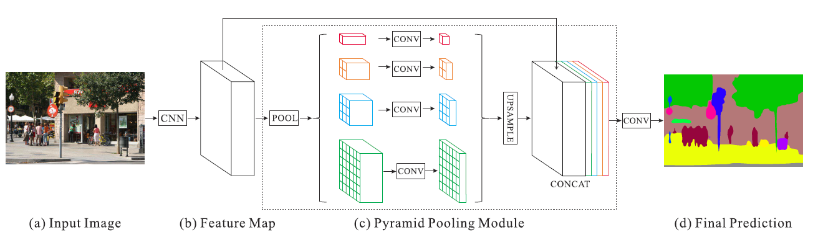
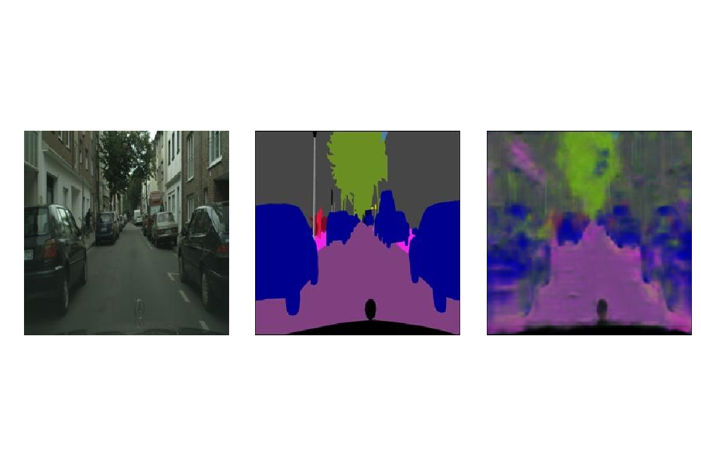

# Sementic Segmentation using PSPNet Model
## Overview
PSPNet (Pyramid Scene Parsing Network) is a state-of-the-art deep learning model for semantic segmentation, designed to understand the context of a scene by aggregating information at different scales. It leverages a pyramid pooling module to capture global context and refine the feature map for precise segmentation.

Key Features

- Global Context Understanding: Utilizes pyramid pooling to capture information from different regions of the image.
- Accurate Segmentation: Provides detailed and accurate segmentation results, even for complex scenes.
- Robust Architecture: Based on the ResNet architecture, known for its strong feature extraction capabilities.
  
Dataset:

The PSPNet model in this project is trained and tested using the Cityscapes dataset, which is a high-quality dataset widely used for semantic segmentation tasks. The Cityscapes data consists of labeled videos captured from vehicles driving through various cities in Germany. This specific version is a processed subsample from the Pix2Pix paper, containing still images from the original videos.

- Content: The dataset includes 2,975 training images and 500 validation images.
- Resolution: Each image is 256x512 pixels.
- Format: Each file is a composite image with the original photo on the left half and the corresponding semantic segmentation label on the right half.
This dataset is particularly valued for its detailed annotations and is one of the best resources for training and evaluating semantic segmentation models.


## Inference
### Import necessary libraries:
```python 
# Importing necessary libraries
import os
import numpy as np
import tensorflow as tf
from tensorflow.keras.preprocessing.image import load_img, img_to_array, ImageDataGenerator
import matplotlib.pyplot as plt
from sklearn.model_selection import train_test_split
from tensorflow.keras.layers import Input, Conv2D, MaxPooling2D, Conv2DTranspose, concatenate, Dropout
from tensorflow.keras.models import Model
from tensorflow.keras.optimizers import Adam
from tensorflow.keras.callbacks import EarlyStopping

```

### Dataset Loading and Preprocessing
```python
train_folder="/kaggle/input/cityscapes-image-pairs/cityscapes_data/cityscapes_data/train/"
valid_folder="/kaggle/input/cityscapes-image-pairs/cityscapes_data/cityscapes_data/val/"

def get_images_masks(path):
    names=os.listdir(path)
    img_g,img_m=[],[]
    for name in names:
        img=cv2.imread(path+name)
        img=cv2.normalize(img,None,0,1,cv2.NORM_MINMAX,cv2.CV_32F)
        img=img[:,:,::-1]
        img_g.append(img[:,:256])
        img_m.append(np.reshape(img[:,256:],(256*256*3)))
        del img
    del names
    return img_g,img_m
        
train_imgs,train_masks=get_images_masks(train_folder)
valid_imgs,valid_masks=get_images_masks(valid_folder)

```

### PSPNet Architecture diagram


### Convolution Block 
```python
def conv_block(X,filters,block):
    # resiudal block with dilated convolutions
    # add skip connection at last after doing convoluion operation to input X
    
    b = 'block_'+str(block)+'_'
    f1,f2,f3 = filters
    X_skip = X
    # block_a
    X = Convolution2D(filters=f1,kernel_size=(1,1),dilation_rate=(1,1),
                      padding='same',kernel_initializer='he_normal',name=b+'a')(X)
    X = BatchNormalization(name=b+'batch_norm_a')(X)
    X = LeakyReLU(alpha=0.2,name=b+'leakyrelu_a')(X)
    # block_b
    X = Convolution2D(filters=f2,kernel_size=(3,3),dilation_rate=(2,2),
                      padding='same',kernel_initializer='he_normal',name=b+'b')(X)
    X = BatchNormalization(name=b+'batch_norm_b')(X)
    X = LeakyReLU(alpha=0.2,name=b+'leakyrelu_b')(X)
    # block_c
    X = Convolution2D(filters=f3,kernel_size=(1,1),dilation_rate=(1,1),
                      padding='same',kernel_initializer='he_normal',name=b+'c')(X)
    X = BatchNormalization(name=b+'batch_norm_c')(X)
    # skip_conv
    X_skip = Convolution2D(filters=f3,kernel_size=(3,3),padding='same',name=b+'skip_conv')(X_skip)
    X_skip = BatchNormalization(name=b+'batch_norm_skip_conv')(X_skip)
    # block_c + skip_conv
    X = Add(name=b+'add')([X,X_skip])
    X = ReLU(name=b+'relu')(X)
    return X
    
def base_feature_maps(input_layer):
    # base covolution module to get input image feature maps 
    
    # block_1
    base = conv_block(input_layer,[32,32,64],'1')
    # block_2
    base = conv_block(base,[64,64,128],'2')
    # block_3
    base = conv_block(base,[128,128,256],'3')
    return base

def pyramid_feature_maps(input_layer):
    # pyramid pooling module
    
    base = base_feature_maps(input_layer)
    # red
    red = GlobalAveragePooling2D(name='red_pool')(base)
    red = tf.keras.layers.Reshape((1,1,256))(red)
    red = Convolution2D(filters=64,kernel_size=(1,1),name='red_1_by_1')(red)
    red = UpSampling2D(size=256,interpolation='bilinear',name='red_upsampling')(red)
    # yellow
    yellow = AveragePooling2D(pool_size=(2,2),name='yellow_pool')(base)
    yellow = Convolution2D(filters=64,kernel_size=(1,1),name='yellow_1_by_1')(yellow)
    yellow = UpSampling2D(size=2,interpolation='bilinear',name='yellow_upsampling')(yellow)
    # blue
    blue = AveragePooling2D(pool_size=(4,4),name='blue_pool')(base)
    blue = Convolution2D(filters=64,kernel_size=(1,1),name='blue_1_by_1')(blue)
    blue = UpSampling2D(size=4,interpolation='bilinear',name='blue_upsampling')(blue)
    # green
    green = AveragePooling2D(pool_size=(8,8),name='green_pool')(base)
    green = Convolution2D(filters=64,kernel_size=(1,1),name='green_1_by_1')(green)
    green = UpSampling2D(size=8,interpolation='bilinear',name='green_upsampling')(green)
    # base + red + yellow + blue + green
    return tf.keras.layers.concatenate([base,red,yellow,blue,green])

def last_conv_module(input_layer):
    X = pyramid_feature_maps(input_layer)
    X = Convolution2D(filters=3,kernel_size=3,padding='same',name='last_conv_3_by_3')(X)
    X = BatchNormalization(name='last_conv_3_by_3_batch_norm')(X)
    X = Activation('sigmoid',name='last_conv_relu')(X)
    X = tf.keras.layers.Flatten(name='last_conv_flatten')(X)
    return X
```

### Model Creation and Summarization
```python
input_layer = tf.keras.Input(shape=np.squeeze(train_imgs[0]).shape,name='input')
output_layer = last_conv_module(input_layer)
model = tf.keras.Model(inputs=input_layer,outputs=output_layer)
```
### Model Training
```python

model.compile(optimizer=tf.keras.optimizers.Adam(learning_rate=0.001),loss='mse')
model.fit(np.array(train_imgs,dtype='float16'),np.array(train_masks,dtype='float16'),
          validation_data=(np.array(valid_imgs,dtype='float16'),np.array(valid_masks,dtype='float16')),
          epochs=20,steps_per_epoch=297,verbose=1,batch_size=10)

#tf.keras.models.save_model(model,'/kaggle/working/best_model.h5')
```


## Evaluation
### Function to print image, predicted and real mask
```python
def plot_imgs(img,mask,pred):
    mask = np.reshape(mask,(256,256,3))
    pred = np.reshape(pred,(256,256,3))
    fig,(ax1,ax2,ax3) = plt.subplots(1,3,figsize=(15,10))
    ax1.imshow(img)
    ax1.axis('off')
    ax2.imshow(mask)
    ax2.axis('off')
    ax3.imshow(pred)
    ax3.axis('off')
```
### Function for prediction
```python
pred_masks = model.predict(np.array(valid_imgs,dtype='float16'))
```
### Prediction on real image
```python
print('-------------Input---------------Actual mask--------------Predicted mask-------')
for i in range(5):
    x = np.random.randint(0,500,size=1)[0]
    plot_imgs(valid_imgs[x],valid_masks[x],pred_masks[x])
```




## Citations

#### Dataset

The dataset used in this project is sourced from Cityscapes, a high-quality dataset for semantic segmentation tasks in urban environments.

- Cityscapes Dataset. Cordts, M., Omran, M., Ramos, S., Rehfeld, T., Enzweiler, M., Benenson, R., Franke, U., Roth, S., Schiele, B. In [*Proceedings of the IEEE Conference on Computer Vision and Pattern Recognition (CVPR)*, 2016](https://www.cityscapes-dataset.com/).

#### Research Paper

The PSPNet model architecture and methodology are based on the following research paper:

- Zhao, H., Shi, J., Qi, X., Wang, X., & Jia, J. (2017). Pyramid Scene Parsing Network. In [*Proceedings of the IEEE Conference on Computer Vision and Pattern Recognition (CVPR)*, 2017](https://arxiv.org/abs/1612.01105).


